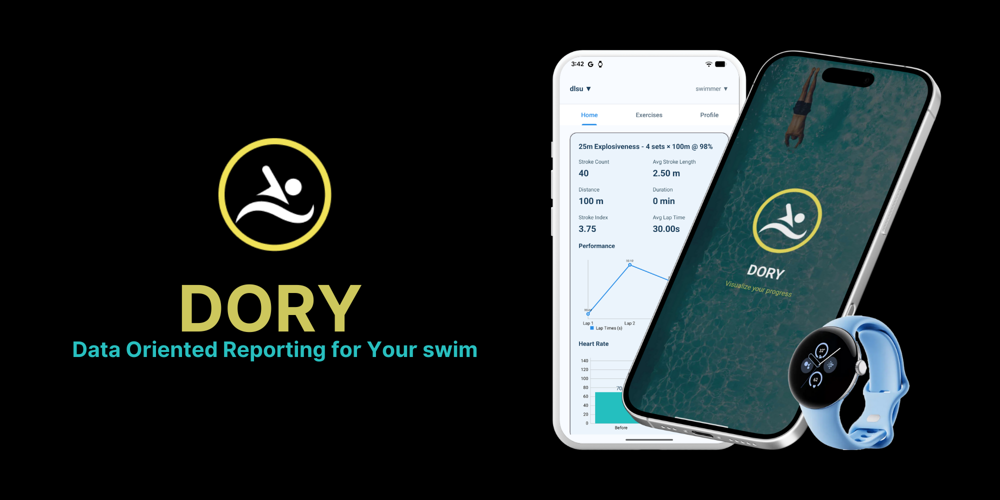

# DORY



Data-Oriented Reporting for Your swim (DORY) is a multi-module Android project consisting of a phone app and a Wear OS companion. The project uses Kotlin, Jetpack Compose, Room, Retrofit, Coroutines, and integrates Google Play Services for Wearable data sync. DORY was developed as the primary technical implementation for a collective thesis project at **De La Salle University**. The project explores the intersection of wearable computing and athletic performance, specifically focusing on data synchronization between Wear OS and handheld devices.

## Modules
- **:mobile** — Main Android application.
- **:wear** — Wear OS companion app packaged alongside the mobile app.

## Tech Stack
- **Language**: Kotlin (JVM target 11)
- **UI**: Jetpack Compose (Compose BOM 2024.05.00, Material 3)
- **Concurrency**: Kotlin Coroutines
- **Networking**: Retrofit (2.11.0) + Gson converter
- **Backend**: Supabase (Auth + PostgREST)
- **Wearable**: Google Play Services Wearable (18.1.0)
- **Rendering**: Google Filament (1.32.1)
- **ML**: TensorFlow Lite (2.13.0)
- **Build**: Gradle Kotlin DSL, Android SDK 35, minSdk 33

## Prerequisites
- Android Studio (Giraffe or newer recommended)
- JDK 11 (bundled with Android Studio is fine)
- Android SDK 35
- Gradle wrapper (included)

## Getting Started
1. Clone the repository and open it in Android Studio.
2. Let Gradle sync finish.
3. Select the desired run configuration:
   - Phone-only: run the `mobile` app.
   - Phone + Wear: pair a Wear emulator or physical watch and deploy both modules.

## Supabase
The mobile app syncs key data to Supabase for persistence and cross-device access.

### Sync behavior
Session and raw sample data are written to Supabase in multiple flows:

- **Watch recording stop**
  - Upserts a `swim_sessions` row
  - Bulk inserts `swim_data` samples
- **Categorize session**
  - Ensures the session summary is upserted
  - Ensures raw samples are uploaded
- **Coach CSV/import flow**
  - Uploads/creates the session and sample rows for the assigned swimmer

## Metrics pipeline (CCSCloud)
After a session and its raw samples are uploaded, the app calls an external metrics service to compute derived metrics (e.g., stroke count, stroke length, stroke index, lap time) and then writes those metrics back to both:

- local Room (`MlResult`)
- Supabase `swim_sessions`

Notes:
- The call can take time for large sessions; the client is configured with longer timeouts.
- If the metrics call fails, logs are emitted under the `DEBUG` tag to help diagnose network/server issues.

### Build from terminal (Windows)
Use the provided Gradle wrapper from the project root:

```
./gradlew.bat assembleDebug
```

Install on a connected device/emulator:

```
./gradlew.bat :mobile:installDebug :wear:installDebug
```

## Project Structure
- `settings.gradle.kts` — Declares `:mobile` and `:wear` modules.
- `mobile/build.gradle.kts` — Android app configuration, dependencies, and Wear companion linkage.
- `wear/build.gradle.kts` — Wear OS app configuration and dependencies.
- `gradle/libs.versions.toml` — Centralized dependency versions (via Version Catalog).

## Troubleshooting
- If Gradle sync fails, ensure the JDK is set to 11 in Project Settings.
- Verify SDK 35 and Android Build Tools are installed.
- Clean and rebuild if KSP/Room generates errors:
  
  ```
  ./gradlew.bat clean build
  ```
- For Wear pairing issues, use Android Studio Device Manager to create and pair Wear and Phone emulators.
